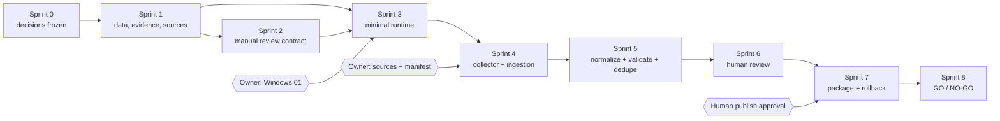

# Content Factory V1 Dependency Map

## Sprint dependency chain



## Component dependencies

| Component | Requires | Blocks if absent |
| --- | --- | --- |
| Property data contract | Frozen scope and architecture placement | Parser mapping, normalization, validation |
| Evidence contract | Source identity, immutable payload/reference, citeable location | Fact review and publication |
| Source registry/policy | Owner-approved 1–2 sources and allowed methods | Collection job creation |
| Review workflow | Data/evidence contracts and immutable decisions | `publish_ready` |
| Isolated runtime | Owner-approved placement and Windows boundary | Collector execution |
| Evidence/version store | Storage decision, hashing, access policy, backup | Parsing and all traceability |
| Collector | Signed source policy and pilot manifest | Ingestion |
| Parser | Approved pilot source format and raw items | Normalization |
| Normalizer | Parsed sections and field contract | Validation |
| Validator | Required-field and evidence rules | Duplicate review/human review |
| Duplicate control | Valid normalized identity keys | Canonical record selection |
| Review client/process | Review state machine, checklist, identity/audit | Package assembly |
| Package assembler | Approved records and adapter contract | Handoff simulation |
| Rollback mechanism | Two package versions and atomic pointer/removal design | Publication approval |

## Data dependencies

```text
Approved Source
  -> Collection Job + Config Snapshot
  -> Immutable Raw Item + Rights Snapshot + SHA-256
  -> Parsed Document + Citeable Sections + Parser Version
  -> Candidate Record (Original + Normalized Values + Rule Version)
  -> Validation Result + Duplicate Group
  -> Immutable Human Decisions
  -> Canonical Approved Record Version
  -> GoThailandHome Package + Manifest + Content Hash
  -> Publish/Rollback Event
```

No downstream object may exist without stable IDs for its direct inputs. Evidence deletion, hash mismatch, missing source permission, or version ambiguity blocks the chain.

## Infrastructure dependencies

| Dependency | Minimum V1 requirement | Decision owner |
| --- | --- | --- |
| Windows 01 readiness | Supported OS/runtime, dedicated service identity, resource baseline, restart behavior | Human Owner |
| Runtime | One approved, pinned runtime; no production app dependency | Human Owner |
| Scheduler | Minimal bounded trigger; manual trigger is acceptable initially | Technical proposal; owner approves |
| Queue | Durable local queue only if needed; explicit job states and idempotency | Technical proposal; owner approves |
| Evidence storage | Dedicated pilot path, integrity hashes, least privilege, capacity alert | Human Owner |
| Runtime metadata store | Isolated and non-production; no schema changes to current DB | Human Owner |
| Backup target | Separate approved destination with encryption and restore proof | Human Owner |
| Network | Allowlist only approved source endpoints and required monitoring/backup paths | Human Owner |
| Secrets | OS/approved secret reference; never source control, payload, or logs | Human Owner |
| Monitoring | Health, job failure, queue depth, disk use, backup status | Technical proposal |
| GoThailandHome adapter fixture | Non-production contract and prior-version pointer | Website owner |

No specific product is silently selected by this plan. Product choices belong in CF3-01.

## Human approval dependencies

| Gate | Must occur after | Must occur before |
| --- | --- | --- |
| G0 Planning | Eight planning documents reviewed | Any implementation |
| G1 Source approval | Rights/method assessment | Collector coding against source; collection |
| G2 Data/evidence standard | Contract examples and tests designed | Parser mapping, ingestion acceptance |
| G3 Technical boundary | Architecture/storage/adapter proposal | Runtime implementation |
| G4 Windows 01 | Security, network, backup/removal review | Deployment |
| G5 Pilot manifest | Sources and candidate projects supplied | Live collection |
| G6 Package publication | Human reviews + rollback rehearsal | Any publication |
| G7 Pilot result | Metrics and residual risks | Repeat/expansion |

## Blocking conditions

- Alpha RC Feature Freeze blocks production website, release, database, and schema changes.
- Missing G0–G5 approval blocks the corresponding implementation or collection stage.
- Source permission ambiguity, prohibited collection method, or unavailable evidence blocks intake.
- More than 2 sources, fewer than 5 or more than 10 projects, or more than 100 records blocks the run.
- Hash mismatch, missing raw evidence/reference, missing rights snapshot, or untraceable field blocks parsing/review/publication.
- Unresolved P0 validation error, duplicate conflict, price/currency conflict, or open mandatory review blocks package assembly.
- Missing backup restore proof or failed health/security check blocks Windows 01 use.
- Failed rollback rehearsal blocks publication.
- Any production endpoint access during the freeze stops the pilot.

## Critical path

`CF0-01 -> CF0-02 -> CF1-01/CF1-02/CF1-03 -> CF1-04 -> CF2-01 -> CF2-03 -> CF3-01 -> CF3-02 -> CF3-03 -> CF3-04 -> CF4-01 -> CF4-02 -> CF4-03 -> CF5-01 -> CF5-02 -> CF5-03 -> CF6-01 -> CF6-02 -> CF6-03 -> CF7-01 -> CF7-02 -> CF7-03 -> CF7-04 -> CF8-01 -> CF8-02 -> CF8-03`

## Parallel work

After CF0-01:

- CF0-02 and CF0-03 can run in parallel.
- CF1-01, CF1-02, and CF1-03 can be drafted in parallel, then reconciled before approval.
- CF2 workflow contracts can be designed while CF3 infrastructure proposals are drafted; runtime implementation waits for both.
- Within CF3, monitoring design and backup design may proceed in parallel after storage boundaries are known.
- Parser golden fixtures may be prepared while collector policy tests are prepared, but parser execution waits for raw ingestion.
- Human intake/fact reviews may be divided across records, but one reviewer checklist and immutable decision format must be used.
- Metrics queries and risk-review templates may be prepared before Sprint 7 completes; results wait for actual evidence.

## Mandatory sequential work

- Source approval before collection.
- Raw evidence persistence before parsing.
- Parsing before normalization; normalization before validation.
- Validation before duplicate resolution and fact approval.
- All mandatory human decisions before package assembly.
- Package assembly before adapter simulation.
- Adapter simulation before rollback rehearsal.
- Successful rollback rehearsal and explicit G6 before any publication.
- Pilot evaluation before any repeat or expansion.

