# Phase 1 Dependency Graph

**Scope:** 36 website tasks; all Windows01-independent  
**Rule:** An arrow `A → B` means B may start only after A’s acceptance criteria pass.

## 1. Full task graph

```mermaid
flowchart TD
  P0[P0 Final Acceptance — GO]

  subgraph M1[M1 Resilient foundation]
    P101[P1-01 Loading/error boundaries]
    P102[P1-02 Accessibility baseline]
    P103[P1-03 Responsive matrix]
    P104[P1-04 Navigation refinement]
  end

  subgraph M2[M2 Discovery and detail]
    P105[P1-05 Homepage hierarchy]
    P106[P1-06 URL filter contract]
    P107[P1-07 Filter interactions]
    P108[P1-08 Results/pagination]
    P109[P1-09 Property cards]
    P110[P1-10 Property detail]
    P111[P1-11 Gallery/media]
    P112[P1-12 Project detail]
    P113[P1-13 Developer detail]
    P114[P1-14 District detail]
  end

  subgraph M3[M3 Engagement and inquiry]
    GFAV{{G-PRODUCT-FAV}}
    GCMP{{G-PRODUCT-COMPARE}}
    P115[P1-15 Favorites contract]
    P116[P1-16 Favorites UI]
    P117[P1-17 Compare contract]
    P118[P1-18 Compare UI]
    P119[P1-19 Form reliability]
    P120[P1-20 Inquiry context]
    P121[P1-21 Journey consolidation]
  end

  subgraph M4[M4 Static content product]
    GCONTENT{{G-CONTENT-PUBLIC}}
    GINV{{G-INVESTMENT}}
    GLEGAL{{G-LEGAL}}
    P122[P1-22 Content loader]
    P123[P1-23 Knowledge articles]
    P124[P1-24 Blog]
    P125[P1-25 Investment guide]
    P126[P1-26 Legal guide]
    P127[P1-27 FAQ hub]
    P128[P1-28 Editorial validation]
  end

  subgraph M5[M5 SEO and measurement]
    GAN{{G-ANALYTICS}}
    P129[P1-29 Content SEO]
    P130[P1-30 Internal linking]
    P131[P1-31 Analytics bootstrap]
    P132[P1-32 Event instrumentation]
  end

  subgraph M6[M6 Hardening and acceptance]
    P133[P1-33 Accessibility fixes]
    P134[P1-34 Responsive fixes]
    P135[P1-35 Performance pass]
    GRELEASE{{G-RELEASE}}
    P136[P1-36 Final acceptance]
  end

  P0 --> P101
  P0 --> P102
  P0 --> P103
  P0 --> P104
  P0 --> P106
  P0 --> GFAV
  P0 --> GCONTENT
  P0 --> GAN

  P104 --> P105
  P102 --> P107
  P106 --> P107
  P106 --> P108
  P107 --> P108
  P108 --> P114
  P102 --> P110
  P110 --> P111
  P102 --> P112
  P111 --> P112
  P102 --> P113

  GFAV --> P115
  P104 --> P116
  P115 --> P116
  P115 --> P117
  GCMP --> P117
  P102 --> P118
  P117 --> P118
  P101 --> P119
  P102 --> P119
  P110 --> P120
  P112 --> P120
  P113 --> P120
  P119 --> P120
  P104 --> P121
  P119 --> P121
  P120 --> P121

  GCONTENT --> P122
  P122 --> P123
  P122 --> P125
  P122 --> P126
  P122 --> P127
  P123 --> P124
  GINV --> P125
  GLEGAL --> P126
  P123 --> P128
  P124 --> P128
  P125 --> P128
  P126 --> P128
  P127 --> P128

  P123 --> P129
  P124 --> P129
  P125 --> P129
  P126 --> P129
  P127 --> P129
  P128 --> P129
  P104 --> P130
  P112 --> P130
  P113 --> P130
  P114 --> P130
  P123 --> P130
  P124 --> P130
  P125 --> P130
  P126 --> P130
  P127 --> P130
  GAN --> P131
  P131 --> P132
  P116 --> P132
  P118 --> P132
  P121 --> P132

  P101 --> P133
  P102 --> P133
  P103 --> P134
  P111 --> P135
  P112 --> P135
  P113 --> P135
  P114 --> P135
  P123 --> P135
  P124 --> P135
  P125 --> P135
  P126 --> P135
  P127 --> P135

  P105 --> P136
  P108 --> P136
  P109 --> P136
  P116 --> P136
  P118 --> P136
  P121 --> P136
  P129 --> P136
  P130 --> P136
  P132 --> P136
  P133 --> P136
  P134 --> P136
  P135 --> P136
  GRELEASE --> P136
```



## 2. Dependency register

| Task | Direct prerequisites |
| --- | --- |
| P1-01 | P0 accepted; error/loading copy |
| P1-02 | P0 route/build harness |
| P1-03 | P0 local server harness |
| P1-04 | Approved information architecture |
| P1-05 | P1-04 |
| P1-06 | None beyond P0 |
| P1-07 | P1-02, P1-06 |
| P1-08 | P1-06, P1-07 |
| P1-09 | Existing property display contract |
| P1-10 | P1-02 |
| P1-11 | P1-10 |
| P1-12 | P1-02, P1-11 |
| P1-13 | P1-02 |
| P1-14 | P1-02, P1-08 |
| P1-15 | G-PRODUCT-FAV |
| P1-16 | P1-04, P1-15 |
| P1-17 | P1-15, G-PRODUCT-COMPARE |
| P1-18 | P1-02, P1-17 |
| P1-19 | P1-01, P1-02 |
| P1-20 | P1-10, P1-12, P1-13, P1-19 |
| P1-21 | P1-04, P1-19, P1-20 |
| P1-22 | G-CONTENT-PUBLIC |
| P1-23 | P1-22, approved article inventory |
| P1-24 | P1-22, P1-23, approved blog inventory |
| P1-25 | P1-22, G-INVESTMENT |
| P1-26 | P1-22, G-LEGAL |
| P1-27 | P1-22, G-CONTENT-PUBLIC |
| P1-28 | Completed applicable P1-23–P1-27 |
| P1-29 | P1-23–P1-28 |
| P1-30 | P1-04, P1-12–P1-14, P1-23–P1-27 |
| P1-31 | G-ANALYTICS |
| P1-32 | P1-31 plus completed target surfaces |
| P1-33 | P1-02 plus completed target surfaces |
| P1-34 | P1-03 plus completed target surfaces |
| P1-35 | P1-11–P1-14, P1-23–P1-29 |
| P1-36 | P1-01–P1-35 or Owner waivers; G-RELEASE |

## 3. Critical path

The likely critical path is:

```text
P1-02
  -> P1-10
  -> P1-11
  -> P1-12
  -> P1-20
  -> P1-21
  -> P1-32
  -> P1-33/P1-34/P1-35
  -> P1-36
```

The content critical path is independent until final acceptance:

```text
G-CONTENT-PUBLIC (CLEARED 2026-07-20 — see G_CONTENT_PUBLIC_OWNER_DECISION_REGISTER.md)
  -> P1-22
  -> P1-23
  -> P1-24
  -> P1-28
  -> P1-29/P1-30
  -> P1-35
  -> P1-36
```

Legal, investment, and analytics approval latency can become the schedule’s
longest constraint even though their implementation work is relatively small.

## 4. Parallel work lanes

After M1 contracts are stable, these lanes can run concurrently:

1. **Discovery lane:** P1-05–P1-14
2. **Engagement lane:** P1-15–P1-21
3. **Content lane:** P1-22–P1-28
4. **Analytics approval/bootstrap lane:** G-ANALYTICS → P1-31
5. **Continuous QA lane:** P1-02/P1-03 evidence collection, then P1-33/P1-34

Avoid parallel edits to shared hotspots:

- `src/components/layout/site-header.tsx` / `site-footer.tsx`
- `src/app/[lang]/properties/page.tsx`
- `src/app/[lang]/projects/[slug]/page.tsx`
- `src/dictionaries/{en,zh,th}.json`
- `src/app/sitemap.ts`
- `src/lib/seo/schema.ts`
- `package.json`

Sequence or coordinate tasks touching the same hotspot to keep reviews independent.

## 5. Dependency boundary

No node in this graph depends on Windows01, live property sources, collectors,
runtime queues/workers, OCR, embeddings, AI backend, database synchronization,
production mutation, or deployment.
