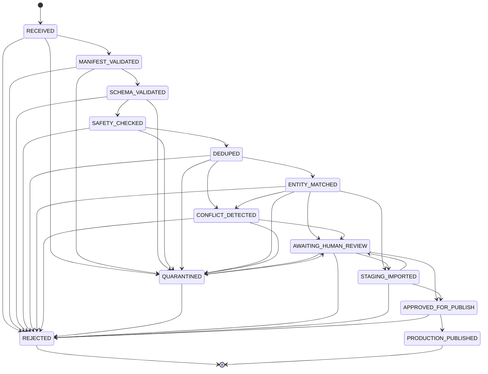

# Windows01 Review State Machine

**Source of truth:** [`src/lib/integrations/windows01/review-state.ts`](../../src/lib/integrations/windows01/review-state.ts)
**Types:** [`src/lib/integrations/windows01/types.ts`](../../src/lib/integrations/windows01/types.ts)
**Rule:** Workers must not jump to publish states. **Approve / publish are human-only.**

---

## 1. States

| State | Terminal? | Notes |
| --- | --- | --- |
| `RECEIVED` | No | Initial (`initialReviewState()`) |
| `MANIFEST_VALIDATED` | No | Manifest OK |
| `SCHEMA_VALIDATED` | No | Record schema OK |
| `SAFETY_CHECKED` | No | URL/path/size/evidence safety OK |
| `DEDUPED` | No | Passed dedup gates |
| `ENTITY_MATCHED` | No | Entity resolution attempted |
| `CONFLICT_DETECTED` | No | Needs human conflict handling |
| `QUARANTINED` | No | Can return to human review or reject |
| `AWAITING_HUMAN_REVIEW` | No | Human decision required |
| `REJECTED` | **Yes** | No further transitions |
| `STAGING_IMPORTED` | No | Accepted into staging import path |
| `APPROVED_FOR_PUBLISH` | No | **Human-only** entry |
| `PRODUCTION_PUBLISHED` | **Yes** | **Human-only** entry; terminal |

Human-only target states (workers must never invoke): `APPROVED_FOR_PUBLISH`, `PRODUCTION_PUBLISHED` — exported as `HUMAN_ONLY_STATES`.

---

## 2. Allowed transitions

From `TRANSITIONS` in `review-state.ts`:

```
RECEIVED                → MANIFEST_VALIDATED | QUARANTINED | REJECTED
MANIFEST_VALIDATED      → SCHEMA_VALIDATED | QUARANTINED | REJECTED
SCHEMA_VALIDATED        → SAFETY_CHECKED | QUARANTINED | REJECTED
SAFETY_CHECKED          → DEDUPED | QUARANTINED | REJECTED
DEDUPED                 → ENTITY_MATCHED | CONFLICT_DETECTED | QUARANTINED | REJECTED
ENTITY_MATCHED          → CONFLICT_DETECTED | AWAITING_HUMAN_REVIEW | STAGING_IMPORTED | QUARANTINED | REJECTED
CONFLICT_DETECTED       → AWAITING_HUMAN_REVIEW | QUARANTINED | REJECTED
QUARANTINED             → AWAITING_HUMAN_REVIEW | REJECTED
AWAITING_HUMAN_REVIEW   → REJECTED | STAGING_IMPORTED | APPROVED_FOR_PUBLISH | QUARANTINED
REJECTED                → (none)
STAGING_IMPORTED        → AWAITING_HUMAN_REVIEW | APPROVED_FOR_PUBLISH | REJECTED
APPROVED_FOR_PUBLISH    → PRODUCTION_PUBLISHED | REJECTED
PRODUCTION_PUBLISHED    → (none)
```

Helpers:

- `canTransition(from, to)`
- `assertTransition(from, to)` — throws `Illegal Windows01 review transition: …`

---

## 3. Diagram



---

## 4. Human-only approve / publish

| Transition | Actor |
| --- | --- |
| `* → APPROVED_FOR_PUBLISH` | Human reviewer only |
| `APPROVED_FOR_PUBLISH → PRODUCTION_PUBLISHED` | Human publisher only |
| Worker / CI / adapter automation | Must **not** call these transitions |

Related worker payload ban (different vocabulary, same intent): `FORBIDDEN_WORKER_STATES` = `APPROVED`, `VERIFIED_FACT`, `PUBLISHED`, `PRODUCTION_READY`.

---

## 5. Adapter happy path (staging)

Automated staging import advances through validation states toward `STAGING_IMPORTED` (or `AWAITING_HUMAN_REVIEW` in dry-run). It must not set `APPROVED_FOR_PUBLISH` or `PRODUCTION_PUBLISHED`. Illegal transitions quarantine as `CONFLICT`.

---

## 6. Operational notes

- Terminal rejects stay rejected; re-ingest as a new batch/record if needed.
- Quarantine is recoverable via human review, not via worker self-approve.
- Production publish remains blocked at the import adapter while deploy env is production or mode is `blocked-production`, even if a review state were incorrectly advanced.
